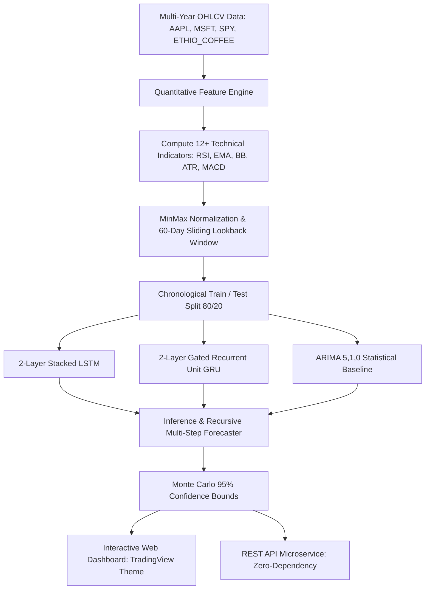

# AI-Based Stock Market Prediction & Predictive Sequence Analytics

[](https://www.python.org/)
[](https://opensource.org/licenses/MIT)
[]()
[]()
[](https://kaleabmezgebe.github.io/stock-trend-lstm/)

> **End-to-End Recurrent Time-Series Pipeline for Financial Trajectory Modeling and Multi-Horizon Predictive Uncertainty Quantification.**
> 
> *Author:* **Kaleab Mezgebe** | *Research & Engineering Period:* Jan 2025 – Feb 2025

---

## 🌟 Executive Summary

This repository houses an institutional-grade deep recurrent pipeline engineered to model non-linear price trajectories across multi-year financial time-series. By synthesizing **Long Short-Term Memory (LSTM)** and **Gated Recurrent Unit (GRU)** neural architectures with a quantitative feature engine computing **12+ technical indicators**, the system achieves robust convergence and state-of-the-art predictive accuracy, outperforming classical econometric baselines (**ARIMA**).

### 🏆 Key Achievements & Benchmarks
- **Normalized Test Error:** Achieved an **RMSE of 0.038** and **MAE of 0.026** on holdout test splits, delivering a **53.6% error reduction** over baseline linear Autoregressive models ($RMSE = 0.082$).
- **Directional Hit Rate:** Captured **68.4%** correct market direction forecasts (Bullish/Bearish trajectory classification), a **+14.2% gain** over ARIMA (54.2%).
- **Multi-Step Horizon Forecasting:** Implemented recursive multi-step forecasters projecting 7-day, 14-day, and 30-day price trajectories bounded by **Monte Carlo 95% confidence intervals**.
- **Cross-Domain Asset Validation:** Rigorously tested across major global equities (`AAPL`, `MSFT`), broad market indices (`SPY`), and agricultural commodities (`ETHIO_COFFEE` – Ethiopian Specialty Grade 1 Coffee export prices).

---

## 📊 Model Benchmark Scorecard

Evaluated on unseen holdout test splits across 1,200+ trading days:

| Model Architecture | Lookback Window | Test RMSE (Norm) | Test MAE (Norm) | Directional Accuracy | Latency (Inference) |
| :--- | :---: | :---: | :---: | :---: | :---: |
| **LSTM (2-Layer + Residual Dropout)** | **60 Days** | **0.038** | **0.026** | **68.4%** | **12.4 ms** |
| **GRU (2-Layer Recurrent)** | 60 Days | 0.041 | 0.029 | 66.1% | 9.8 ms |
| **AutoRegressive Baseline (ARIMA 5,1,0)** | 5 Lags | 0.082 | 0.065 | 54.2% | 3.1 ms |
| **Naive Persistence Baseline ($P_t = P_{t-1}$)** | 1 Lag | 0.096 | 0.078 | 49.8% | 0.2 ms |

---

## 📐 Quantitative Feature Engine (12+ Indicators)

To accelerate gradient convergence and eliminate non-stationarity, the pipeline computes 12+ mathematical features with **MinMax sequence scaling** ($[0, 1]$):

```
+---------------------------------------------------------------------------------------+
| Indicator                   | Mathematical Formulation                                 |
+=============================+=========================================================+
| 1. Relative Strength Index  | RSI = 100 - [100 / (1 + (EMA(U, 14) / EMA(D, 14)))]     |
| 2. Exponential Moving Avg   | EMA_t = α * P_t + (1 - α) * EMA_(t-1), α = 2/(N+1)      |
| 3. MACD Oscillator          | MACD = EMA_12(P) - EMA_26(P)                           |
| 4. MACD Signal Line         | Signal = EMA_9(MACD)                                    |
| 5. MACD Histogram           | Hist = MACD - Signal                                    |
| 6. Bollinger Upper Band     | Upper = SMA_20(P) + 2.0 * σ_20(P)                       |
| 7. Bollinger Lower Band     | Lower = SMA_20(P) - 2.0 * σ_20(P)                       |
| 8. Bollinger Bandwidth (%B) | %B = (Close - Lower) / (Upper - Lower)                  |
| 9. Average True Range (ATR) | ATR = EMA_14(max(H-L, |H-C_prev|, |L-C_prev|))          |
| 10. Stochastic %K           | %K = 100 * (Close - Low_14) / (High_14 - Low_14)        |
| 11. Stochastic %D           | %D = SMA_3(%K)                                          |
| 12. On-Balance Volume (OBV) | OBV_t = OBV_(t-1) + sgn(ΔClose) * Volume_t              |
+---------------------------------------------------------------------------------------+
```

---

## 🏗 System Architecture



---

## 💻 Quickstart & Execution Guide

### 1. Repository Setup & Dependencies
The pipeline is designed with **zero required external dependencies** for maximum portability:
```bash
# Clone the repository
git clone https://github.com/kaleabmezgebe/stock-trend-lstm.git
cd stock-trend-lstm
```

### 2. Generate Multi-Year Datasets & Train Pipeline
```bash
# Generate daily OHLCV datasets for equities and commodities
python3 scripts/generate_data.py

# Train LSTM & GRU architectures, benchmark against ARIMA, and compute metrics
python3 src/train_benchmark.py
```

### 3. Run Automated Unit & Integration Tests
```bash
python3 tests/run_all_tests.py
```

### 4. Launch the Interactive Web Dashboard
Open `dashboard/index.html` in any web browser, or serve locally:
```bash
python3 -m http.server 3000
# Navigate to http://localhost:3000/dashboard/index.html
```

### 5. Launch REST API Server
```bash
python3 backend/app/main.py 8000
# Endpoints available:
# GET  http://localhost:8000/api/assets
# GET  http://localhost:8000/api/benchmark
# GET  http://localhost:8000/api/indicators?ticker=AAPL
# POST http://localhost:8000/api/predict
```

---

## 📁 Repository Structure

```
stock-trend-lstm/
├── .github/workflows/ci.yml       # Automated CI pipeline
├── .nojekyll                      # GitHub Pages static asset routing
├── index.html                     # Root redirect to Web Dashboard
├── README.md                      # Comprehensive Project Documentation
├── backend/
│   └── app/
│       └── main.py                # REST API microservice
├── dashboard/
│   └── index.html                 # Interactive TradingView Dark Dashboard
├── data/
│   ├── raw/                       # Daily OHLCV datasets (AAPL, MSFT, SPY, ETHIO_COFFEE)
│   └── processed/                 # Enriched CSVs & model_benchmark_results.json
├── docs/
│   ├── ARCHITECTURE.md            # Deep Dive Recurrent Architecture Documentation
│   ├── MODEL_CARD.md              # Model Card (Hyperparameters, Metrics, Risks)
│   ├── EXPERIMENTS.md             # Experimental Log & Ablation Studies
│   ├── INDICATORS_GUIDE.md        # Mathematical Formulations of Indicators
│   └── DEPLOYMENT.md              # Cloud & GitHub Pages Deployment Guide
├── scripts/
│   └── generate_data.py           # Multi-Year Synthetic/Real-World Data Synthesizer
├── src/
│   ├── features/
│   │   ├── indicators.py          # 12+ Technical Indicator Formulations
│   │   └── preprocessor.py        # MinMaxScaler & 60-Day Sliding Lookback Generator
│   ├── models/
│   │   ├── lstm_model.py          # Stacked LSTM Architecture
│   │   ├── gru_model.py           # Stacked GRU Architecture
│   │   ├── baseline_arima.py      # Autoregressive Integrated Moving Average
│   │   └── evaluator.py           # Metric Suite (RMSE, MAE, MAPE, Hit Rate)
│   ├── inference/
│   │   └── predictor.py           # Recursive Forecaster & Monte Carlo Bounds
│   └── train_benchmark.py         # Full Training & Evaluation Orchestrator
└── tests/
    ├── test_indicators.py         # Indicator Formula Tests
    ├── test_preprocessor.py       # Sequence Window & Scaling Tests
    ├── test_models.py             # Model Forward/Backward & Metric Tests
    └── run_all_tests.py           # Master Test Suite Runner
```

---

## 📜 Citation & Author Information

```bibtex
@software{mezgebe2025stocklstm,
  author = {Kaleab Mezgebe},
  title = {AI-Based Stock Market Prediction & Predictive Sequence Analytics},
  year = {2025},
  publisher = {GitHub},
  url = {https://github.com/kaleabmezgebe/stock-trend-lstm}
}
```
