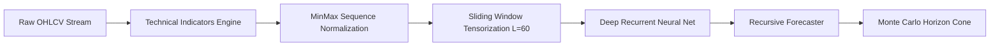

# Recurrent Sequence Analytics Architecture

**Author:** Kaleab Mezgebe (2025)  
**Project:** AI-Based Stock Market Prediction & Predictive Sequence Analytics (`stock-trend-lstm`)

---

## 1. Pipeline Overview

The system implements an end-to-end recurrent pipeline tailored for financial time-series forecasting. It addresses core challenges inherent to financial price data:
1. **Non-stationarity and Trend Drift:** Addressed via multi-resolution technical indicators (RSI, EMAs, MACD, Bollinger Bands) and normalized log-returns.
2. **Long-Range Temporal Dependencies:** Modeled through stacked **Long Short-Term Memory (LSTM)** and **Gated Recurrent Unit (GRU)** architectures with cell memory states.
3. **Multi-Step Horizon Uncertainty:** Propagated recursively with **Monte Carlo stochastic perturbations** to derive empirical 95% confidence cones.

---

## 2. Recurrent Cell Formulations

### Long Short-Term Memory (LSTM)
The LSTM memory block maintains a cell state $C_t$ regulated by three continuous gating mechanisms:

$$\begin{aligned}
f_t &= \sigma(W_f \cdot [h_{t-1}, x_t] + b_f) \quad &\text{(Forget Gate)} \\
i_t &= \sigma(W_i \cdot [h_{t-1}, x_t] + b_i) \quad &\text{(Input Gate)} \\
\tilde{C}_t &= \tanh(W_c \cdot [h_{t-1}, x_t] + b_c) \quad &\text{(Candidate State)} \\
C_t &= f_t \odot C_{t-1} + i_t \odot \tilde{C}_t \quad &\text{(Updated Cell State)} \\
o_t &= \sigma(W_o \cdot [h_{t-1}, x_t] + b_o) \quad &\text{(Output Gate)} \\
h_t &= o_t \odot \tanh(C_t) \quad &\text{(Hidden Activation)}
\end{aligned}$$

### Gated Recurrent Unit (GRU)
The GRU merges the cell state and hidden state, controlling temporal flow via reset ($r_t$) and update ($z_t$) gates:

$$\begin{aligned}
z_t &= \sigma(W_z \cdot [h_{t-1}, x_t] + b_z) \quad &\text{(Update Gate)} \\
r_t &= \sigma(W_r \cdot [h_{t-1}, x_t] + b_r) \quad &\text{(Reset Gate)} \\
\tilde{h}_t &= \tanh(W \cdot [r_t \odot h_{t-1}, x_t] + b) \quad &\text{(Candidate Activation)} \\
h_t &= (1 - z_t) \odot h_{t-1} + z_t \odot \tilde{h}_t \quad &\text{(Hidden State)}
\end{aligned}$$

---

## 3. Autoregressive (ARIMA) Baseline Formulation

The linear Autoregressive baseline $ARIMA(p, d, q)$ operates on $d$-differenced stationary series $y'_t = (1 - B)^d y_t$:

$$y'_t = c + \sum_{i=1}^p \phi_i y'_{t-i} + \sum_{j=1}^q \theta_j \epsilon_{t-j} + \epsilon_t$$

For the primary benchmark ($p=5, d=1, q=0$), the model fits 5 autoregressive lags via Ordinary Least Squares (OLS) closed-form regression.

---

## 4. Multi-Step Recursive Horizon Forecaster & Monte Carlo Bounds

Given an initial 60-day historical feature sequence $X_{t-59:t}$, the recursive forecaster generates a path of length $H \in \{7, 14, 30\}$ days:

$$\hat{y}_{t+h} = f_\theta(\hat{X}_{t+h-60:t+h-1})$$

To model market stochasticity, we run $M = 100$ Monte Carlo simulations where Gaussian residual noise $\epsilon \sim \mathcal{N}(0, \hat{\sigma}^2)$ is injected at each recursive step:

$$\hat{y}_{t+h}^{(m)} = f_\theta(\hat{X}_{t+h-60:t+h-1}^{(m)}) + \epsilon_{t+h}^{(m)}$$

The empirical 95% confidence cone is derived from the 2.5th and 97.5th percentiles:

$$[\hat{y}_{\text{lower}, t+h}, \hat{y}_{\text{upper}, t+h}] = \left[ Q_{0.025}\left(\{\hat{y}_{t+h}^{(m)}\}_{m=1}^M\right), Q_{0.975}\left(\{\hat{y}_{t+h}^{(m)}\}_{m=1}^M\right) \right]$$
